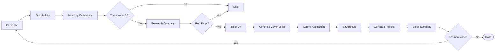

# JobFinder — Agent Guide

## Essential Commands
- **Install deps**: `pip install -r requirements.txt`
- **Install Playwright browsers**: `playwright install chromium`
- **Download spaCy model**: `python -m spacy download en_core_web_sm`
- **Run CLI**: `python -m src.main analyze <cv.pdf>` or `python -m src.main search <cv.pdf>`
- **Run as package**: `ai-job-finder analyze <cv.pdf>`
- **Run migrations**: `alembic upgrade head`
- **Run tests**: `pytest`
- **Set up**: `cp .env.template .env` and fill in API keys

## Project Structure
```
ai-job-finder/
├── alembic/                 # Database migrations
├── config/                  # Settings + scraper_selectors.json
├── data/                    # SQLite DB, CV storage, reports, tailored CVs
├── docs/                    # Documentation
├── src/
│   ├── main.py              # CLI entry point (10 commands)
│   ├── database.py          # 7 SQLAlchemy models
│   ├── daemon.py            # Autonomous job-finding loop
│   ├── tailoring.py         # Per-job CV + cover letter generation
│   ├── company_research.py  # Company intelligence + red flags
│   ├── optimization.py      # Response tracking + strategy optimization
│   ├── reporter.py          # HTML/text report generation
│   ├── auto_applier/        # Playwright form sub + CAPTCHA detection
│   ├── cv_processor/        # Parser, scorer, AI improver
│   ├── job_scraper/         # LinkedIn, Indeed, Glassdoor + engine
│   ├── matcher/             # Embedding-based matching
│   ├── notification/        # Rich console + email
│   └── utils/               # Exceptions, logging, cache, export, skills
├── tests/                   # Test suite
├── .env.template
├── requirements.txt
├── pyproject.toml           # Build config
├── AGENTS.md / MEMORY.md    # Agent knowledge base
└── goal-autonomous-upgrade.md  # Original upgrade prompt
```

## CLI Commands
- `analyze <cv>` — Parse, score, improve CV (--domain, --format, --output, --user)
- `search <cv>` — Scrape & match jobs (--query, --location, --top-k, --format, --output, --user)
- `apply` — Submit applications (--index, --all, --cv, --cover-letter, --user)
- `list` — Show saved applications (--status, --limit)
- `stats` — Summary statistics
- `profile [email]` — Manage user profiles (--name, --phone, --domain, --location)
- `daemon` — Run autonomous job-finding loop (--once, --dry-run)
- `track-response <id> <status>` — Track application outcomes (rejected|interview|ghosted|offer)
- `report` — Show full application summary + performance analysis
- `migrate` — Run database migrations

## Key Architecture Changes
- Custom exception hierarchy (JobFinderError + 19 subclasses)
- Structured JSON logging (Rich console + file output)
- Database session context manager (session_scope)
- AI API caching (24h TTL, disk-based, SHA256 keys)
- Scraper retry logic (exponential backoff, 3 retries)
- Externalized selectors (config/scraper_selectors.json)
- CAPTCHA detection (reCAPTCHA, hCaptcha, Cloudflare)
- Alembic migrations (3 migration files, run_migrations())
- Skills taxonomy (140+ skills, 8 categories, aliases + related)
- Job persistence + URL dedup (DB-level unique constraint)
- Rich progress indicators (bars + spinners)
- Glassdoor scraper (blocked page detection)
- Export engine (JSON + PDF via fpdf2)
- Multi-user support (UserProfile, --user flags, profile command)
- Anonymous user mode (no --user flag required)

## Autonomous Mode
- Autonomous daemon loop (src/daemon.py)
- 24/7 background mode: `ai-job-finder daemon`
- One-shot/cron mode: `ai-job-finder daemon --once`
- Dry-run preview: `ai-job-finder daemon --once --dry-run`
- Per-job CV tailoring (src/tailoring.py)
- Company intelligence research (src/company_research.py)
- Red flag detection (configurable keyword list)
- Application retry logic (exponential backoff, iframe awareness)
- Per-site success/failure tracking
- Response tracking CLI: `ai-job-finder track-response <id> <status>`
- Auto-ghosted detection (14 days, configurable)
- CV strategy optimization (callback rate per CV version)
- HTML + JSON daily reports (data/reports/)
- Email daily summary (configurable)

## Database Models (7 total)
- UserProfile, User, JobPosting, Application, CVImprovementLog
- CompanyResearch — company intelligence + red flags
- ApplicationResult — detailed application tracking + outcomes

## Important Constraints
- **LinkedIn scraping is fragile** — uses list-based extraction (no sign-in required). Update selectors in `config/scraper_selectors.json`
- **Indeed/Glassdoor scrapers** include blocked page detection (Cloudflare)
- **Rate limiting**: scrapers have 2-5s delays — do not reduce
- **AI API caching**: 24h TTL
- **No official LinkedIn API** — scraping is the only option
- **spaCy model required**: `python -m spacy download en_core_web_sm`
- **Playwright browsers required**: `playwright install chromium`
- **CRITICAL: Autonomous mode should START with `--dry-run`** to verify pipeline
- **AUTO_APPLY_THRESHOLD=0.6** — only applies above this match score
- **MAX_APPLICATIONS_PER_RUN=10** — caps applications per daemon cycle
- **CONFIRM_BEFORE_SUBMIT=false** in daemon mode, true in interactive CLI
- **AI SDK**: uses `google.genai` (not deprecated `google.generativeai`)
- **Default AI model**: `gemini-3.5-flash` (set via AI_MODEL in .env)

## CV Parser Details
- Flexible heading matching — detects UPPERCASE, Title Case, and lowercase section headers
- Word-boundary regex for skill extraction (eliminates false positives like "r", "sh", "es")
- 140+ skills across 8 categories in skills taxonomy
- Skills taxonomy cached in memory after first load (not re-read from disk)

## Daemon Pipeline Flow



## Need to Address
- Branch protection is temporarily relaxed on `main` so the repo owner can merge PRs without an additional reviewer. This should be restored to stricter enforcement after the repo has a second reviewer or collaborator.
